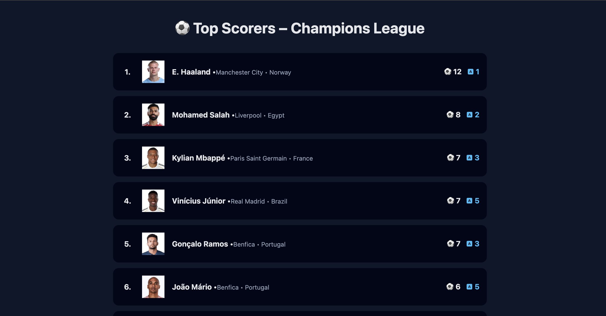

## Simple NestJS app with DDD + CQRS + RestApi + Prisma + PostgreSQL + Docker + Vue

___

Application boilerplate for building scalable server-side applications using NestJS framework with:
* Domain-Driven Design (DDD) principles, 
* Command Query Responsibility Segregation (CQRS) pattern, 
* Prisma ORM for database interactions, 
* PostgreSQL as the database, 
* PGAdmin for database management,
* Docker for containerization, 
* Vue.js for the frontend.
* Rest API https://api-sports.io/ to fetch sports data.

___

